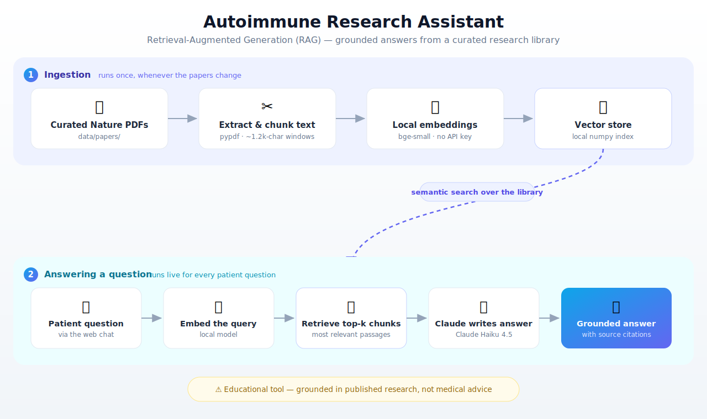

# Autoimmune Research Assistant

A small, low-cost chatbot that lets patients and caregivers ask questions and get answers
**grounded only in a curated library of research papers** — not the open internet, and not the
model's own memory. Answers are written by **Claude (Haiku)**; retrieval uses a **local
embedding model** that runs on-device, so the only API key you need is for Claude.

A Next.js chat front end talks to a Python (FastAPI) backend that does the **RAG**
(Retrieval-Augmented Generation):



Because the model is instructed to answer **only** from the retrieved chunks, it can't wander
off into unvetted claims, and every answer comes with the source paper + page.

---

## Setup (one time)

```bash
cd autoimmune-research-assistant
python3 -m venv .venv && source .venv/bin/activate
pip install -r requirements.txt

cp .env.example .env
# then edit .env and paste your Claude key from https://console.anthropic.com/
```

## Providers

- **Embeddings (retrieval)** run **locally** — a small `bge-small` model via `fastembed`,
  downloaded once and cached. No API key, no per-call cost.
- **Answers** are written by **Claude Haiku** by default. The first time the model runs it
  downloads (~130 MB); after that it's on-device.

You can optionally switch the answer step to Gemini by setting `CHAT_PROVIDER=gemini` and
`GEMINI_API_KEY=...` in `.env`, but the default needs only an `ANTHROPIC_API_KEY`.

## Add your research

Drop the PDFs you want the assistant to use into:

```
data/papers/
```

Then build the index (re-run this whenever you add/remove papers):

```bash
python backend/ingest.py
```

## Run with Docker (one command)

If you have Docker Desktop, this is the easiest way to try it.

```bash
cp .env.example .env          # then paste your Claude key into .env
# put your PDFs in data/papers/

docker compose run --rm backend python ingest.py   # build the index (once per paper change)
docker compose up --build                          # start the API + web app
```

Open **http://localhost:3000**.

The backend runs on port 8000, the web app on 3000. Your papers (`data/`) and the generated
index (`backend/store/`) are mounted from your machine, so they persist between runs.

---

## Run it without Docker

Two processes — the Python API and the Next.js web app.

Terminal 1 — the backend API (port 8000):

```bash
uvicorn backend.server:app --reload --port 8000
```

Terminal 2 — the web app (port 3000):

```bash
cd web
npm install        # first time only
cp .env.local.example .env.local   # points the app at the backend
npm run dev
```

Open **http://localhost:3000** and start asking questions.

---

## Cost

Roughly, for a small library:
- **Embedding** the papers: **free** — it runs locally, no API calls.
- **Each question**: one local embedding (free) + one Claude Haiku call — well under a cent each.

Claude Haiku is one of the cheaper capable models ($1 / $5 per million input / output tokens),
which fits a patient-facing, possibly-high-volume tool. Moving embeddings on-device removes the
per-call retrieval cost entirely.

## Safety design

This is a patient-facing medical tool, so guardrails are built in:
- The model is constrained to the curated library and told to say "this isn't covered" rather than guess.
- It is instructed never to diagnose or recommend specific treatments/doses, and to defer to a clinician.
- A persistent on-screen disclaimer states it is educational, not medical advice.
- Every answer shows its sources for verification.

These reduce risk but do not eliminate it. Before any public launch, have a clinician/compliance
reviewer sign off, and confirm you have the rights to use the papers you ingest.

## Project layout

```
backend/
  config.py         settings + paths (chunk size, top-k, models)
  embeddings.py     local on-device embeddings (fastembed, no API key)
  anthropic_client.py  Claude SDK wrapper (answer generation)
  gemini_client.py  optional Gemini chat fallback
  llm.py            picks the answer provider from CHAT_PROVIDER
  ingest.py         PDF -> chunks -> embeddings -> local index
  rag.py            retrieval + grounded answer generation
  server.py         FastAPI: the /api/chat endpoint
web/                Next.js + Tailwind chat front end
  app/components/Chat.tsx   the chat UI
  app/api/chat/route.ts     proxies requests to the Python backend
data/papers/        <- you put PDFs here
```
