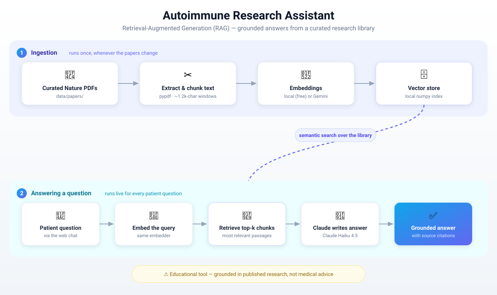

# Autoimmune Research Assistant

A small, low-cost chatbot that lets patients and caregivers ask questions and get answers
**grounded only in a curated library of research papers** — not the open internet, and not the
model's own memory. Both the **answer** step and the **embedding** step are pluggable: answers
default to **Claude (Haiku)**, and embeddings default to a **local on-device model** (no key) but
can switch to **Gemini**.

A Next.js chat front end talks to a Python (FastAPI) backend that does the **RAG**
(Retrieval-Augmented Generation):



Because the model is instructed to answer **only** from the retrieved chunks, it can't wander
off into unvetted claims, and every answer comes with the source paper + page.

---

## Setup (one time)

```bash
cd autoimmune-research-assistant
python3 -m venv .venv && source .venv/bin/activate
pip install -r requirements.txt

cp .env.example .env
# then edit .env and paste your Claude key from https://console.anthropic.com/
```

## Providers

Two independent choices, both set in `.env`:

| Step | Env var | Options | Default |
|---|---|---|---|
| **Answers** | `CHAT_PROVIDER` | `anthropic` (Claude Haiku) · `gemini` (Flash) | `anthropic` |
| **Embeddings** | `EMBED_PROVIDER` | `local` (on-device, free, no key) · `gemini` (text-embedding-004) | `local` |

Set the key(s) for whatever you pick — `ANTHROPIC_API_KEY` and/or `GEMINI_API_KEY`.

> ⚠️ **If you change `EMBED_PROVIDER`, re-run `ingest.py`.** The index must be built and queried
> with the same embedder (different models produce different, incompatible vectors). The app
> refuses to answer on a mismatch and tells you to re-ingest, rather than returning nonsense.

## Add your research

Two sources, both indexed by the same command:

- **PDFs** — drop them in `data/papers/`
- **Web pages** — list URLs (one per line) in `data/urls.txt`. Each page is fetched and its
  **main article text** is extracted (nav/menus/footers stripped) before indexing.

Then build the index (re-run whenever you add/remove sources):

```bash
python backend/ingest.py
```

## Run with Docker (one command)

If you have Docker Desktop, this is the easiest way to try it.

```bash
cp .env.example .env          # then paste your Claude key into .env
# put your PDFs in data/papers/

docker compose run --rm backend python ingest.py   # build the index (once per paper change)
docker compose up --build                          # start the API + web app
```

Open **http://localhost:3000**.

The backend runs on port 8000, the web app on 3000. Your papers (`data/`) and the generated
index (`backend/store/`) are mounted from your machine, so they persist between runs.

---

## Run it without Docker

Two processes — the Python API and the Next.js web app.

Terminal 1 — the backend API (port 8000):

```bash
uvicorn backend.server:app --reload --port 8000
```

Terminal 2 — the web app (port 3000):

```bash
cd web
npm install        # first time only
cp .env.local.example .env.local   # points the app at the backend
npm run dev
```

Open **http://localhost:3000** and start asking questions.

---

## Cost

Roughly, for a small library:
- **Embedding** the papers: **free** with `EMBED_PROVIDER=local`; a fraction of a cent per paper
  with `gemini`.
- **Each question**: one embedding (free locally) + one Claude Haiku call — well under a cent each.

Claude Haiku is one of the cheaper capable models ($1 / $5 per million input / output tokens),
which fits a patient-facing, possibly-high-volume tool.

## Safety design

This is a patient-facing medical tool, so guardrails are built in:
- The model is constrained to the curated library and told to say "this isn't covered" rather than guess.
- It is instructed never to diagnose or recommend specific treatments/doses, and to defer to a clinician.
- A persistent on-screen disclaimer states it is educational, not medical advice.
- Every answer shows its sources for verification.

These reduce risk but do not eliminate it. Before any public launch, have a clinician/compliance
reviewer sign off, and confirm you have the rights to use the papers you ingest.

## Project layout

```
backend/
  config.py         settings + paths (chunk size, top-k, models)
  embeddings.py     embeddings dispatcher — local (fastembed) or Gemini
  anthropic_client.py  Claude SDK wrapper (answer generation)
  gemini_client.py  Gemini SDK wrapper (embeddings + optional chat)
  llm.py            picks the answer provider from CHAT_PROVIDER
  ingest.py         PDF -> chunks -> embeddings -> local index
  rag.py            retrieval + grounded answer generation
  server.py         FastAPI: the /api/chat endpoint
web/                Next.js + Tailwind chat front end
  app/components/Chat.tsx   the chat UI
  app/api/chat/route.ts     proxies requests to the Python backend
data/papers/        <- you put PDFs here
```
